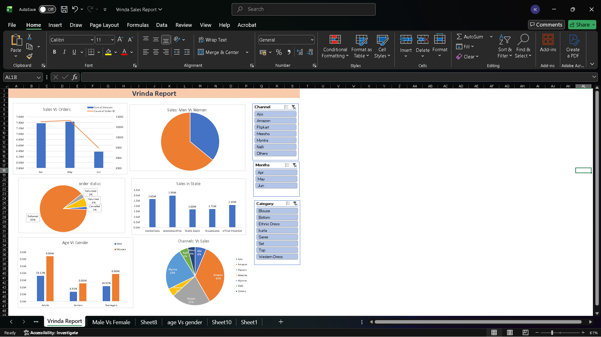

# E-commerce Sales Analytics Dashboard (Vrinda Report)

## Project Summary
This project focuses on analyzing e-commerce sales data using MS Excel to understand sales performance and customer behavior. An interactive dashboard was created to explore trends across different channels, customer demographics, product categories, and order status.

## Key Objectives
- Analyze sales performance across:
  - Sales channels
  - Gender and age group
  - Product category
  - State-wise distribution
  - Order status
- Enable easy comparison using interactive filters

## Dashboard Features
- Interactive dashboard built in MS Excel
- Pie charts and bar graphs for clear visualization
- Dynamic slicers for channels, months, and categories
- Easy drill-down for detailed sales analysis

## Tools & Skills Used
- MS Excel  
- Data Cleaning  
- Pivot Tables  
- Charts & Visualizations  
- Slicers & Filters  
- Sales Analytics

## Dashboard Preview

## Business Insights
- Supports targeted marketing strategies
- Helps identify high-performing sales channels
- Assists in inventory planning and demand forecasting

## Author
**Indradev**

